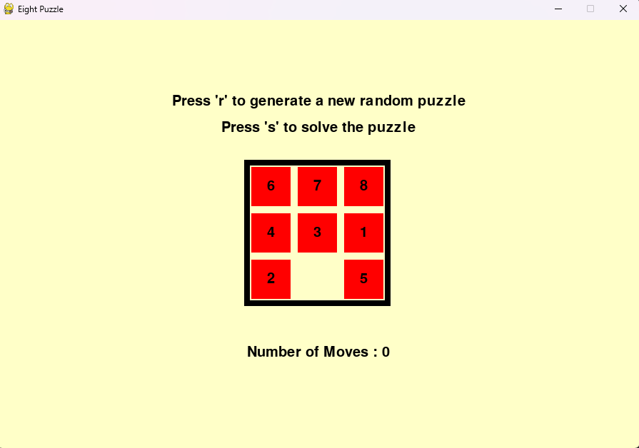
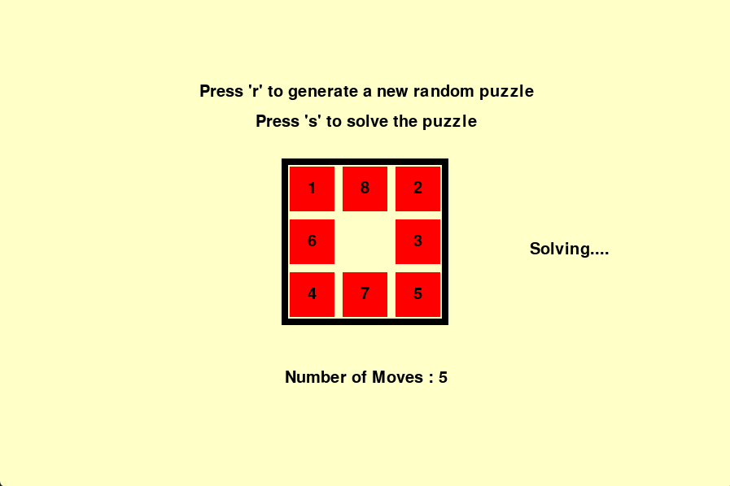
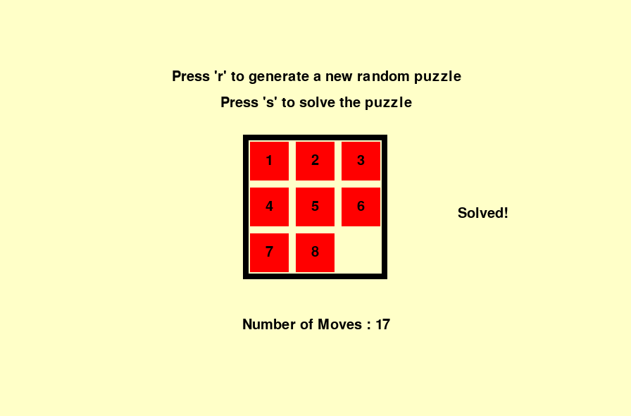

# 8Puzzle
8Puzzle game solver using pygame

# Required installation
```python
pip install pygame
```
## Running the Program
```python
py EightPuzzleGame.py
```

## Description 
Try on the Eight Puzzle Game by using the arrow keys or clicking on a tile.



If you can't solve it, press the "s" button and the program will solve it for you



Once the puzzle is solved, press the "r" button to create a new random puzzle. Don't worry, the program will give out a **solvable** puzzle!

## Additional information
The program uses an A-star search algorithm to solve the puzzle. The heuristic function available are 
- misplaced tiles
- manhattan distance
- gasching 

By default, the program uses manhattan distance as my test reveals it to be the fastest among the other heursitics

